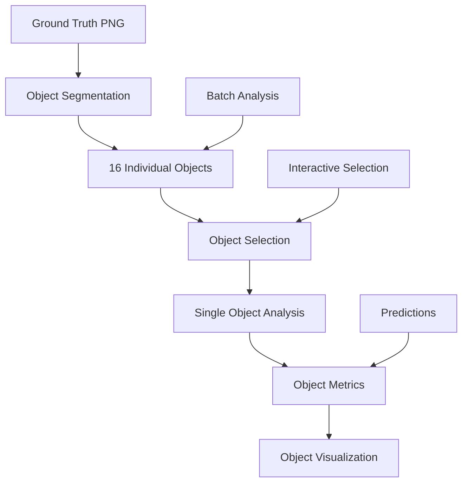

# Comprehensive Session Documentation: Ground Truth Integration & Supervised Metrics for Wavelength Selection Pipeline V2

## Table of Contents
1. [Session Overview](#session-overview)
2. [Initial Problem Statement](#initial-problem-statement)
3. [Architectural Design Decisions](#architectural-design-decisions)
4. [Implementation Details](#implementation-details)
5. [Object-Level Analysis Design (Future)](#object-level-analysis-design-future)
6. [Testing and Validation](#testing-and-validation)
7. [Key Files and Locations](#key-files-and-locations)
8. [Usage Patterns](#usage-patterns)
9. [Critical Details to Remember](#critical-details-to-remember)

---

## Session Overview

### Date and Context
- **Session Purpose**: Major refactoring of wavelength selection pipeline to integrate ground truth tracking and supervised learning metrics
- **Primary Goal**: Transform clustering evaluation from unsupervised metrics (silhouette score, etc.) to supervised metrics (accuracy, precision, recall, F1) by maintaining ground truth throughout the pipeline
- **Key Innovation**: Pixel-level ground truth preservation enabling accurate performance measurement

### Core Achievements
1. Created `wavelengthselectionV2.py` - complete pipeline with ground truth integration
2. Implemented three new modules:
   - `ground_truth_tracker.py` - Pixel-level ground truth preservation
   - `supervised_metrics.py` - Comprehensive supervised learning metrics
   - `supervised_visualizations.py` - Publication-quality visualizations
3. Enhanced visualizations with ROI overlay showing accuracy metrics
4. Extended analysis from "combinations vs purity" to "combinations vs all metrics"
5. Fixed configuration limitation (was running only 3, now runs all 43)

---

## Initial Problem Statement

### User's Requirements
The user needed to track performance accurately based on ground truth for their hyperspectral wavelength selection research. Specific needs:

1. **Ground Truth Integration**: "We need to track the performance accurately based on ground truth"
2. **Per-Object Metrics**: "Be able to measure accuracies for each object in the image"
3. **Supervised Metrics**: "Refactor our metrics to use Supervised Learning metrics like precision, accuracy, recall etc."
4. **Data Structure**:
   - 4 lichen types (classes)
   - 16 total objects (instances within classes)
   - Objects are spatially separable
5. **ROI Constraints**: "ROIs are strictly covering one class"
6. **Clean Implementation**: "We should not alter existing code, rather create new ones, much cleaner and better organized"

### Critical Context from User
> "Basically I want to be able to select single object (out of 16, not the 4 classes) and study its accuracy and the rest of the metrics. That way, if we pixel-wise assign the classes of predicted, original, we'll be able to calculate all the metrics based on the selected sample."

This indicates the need for hierarchical analysis: pixel → object → class levels.

---

## Architectural Design Decisions

### Overall Architecture Philosophy
- **Separation of Concerns**: New modules don't modify existing code
- **Data Flow Preservation**: Maintain original pipeline structure while adding tracking
- **Hierarchical Tracking**: Support pixel, ROI, object, and class-level analysis

### Core Design Patterns

#### 1. Pixel-Level Ground Truth Tracking
```python
# Fundamental data structure
pixel_ground_truth = {
    'class_map': np.array,      # H×W array with class IDs (0-3)
    'object_map': np.array,      # H×W array with object IDs (0-15) [FUTURE]
    'pixel_index': dict,         # {(x,y): {'class': int, 'object': int}}
    'class_colors': dict,        # {class_id: RGB}
    'object_info': dict          # {object_id: {'class': int, 'pixels': set}}
}
```

#### 2. ROI-to-Class Mapping
Each ROI is mapped to its ground truth class with purity verification:
```python
roi_mapping = {
    'roi_id': str,
    'coordinates': (y_start, y_end, x_start, x_end),
    'ground_truth_class': int,
    'purity': float,  # Should be 1.0 for single-class ROIs
    'pixel_count': int
}
```

#### 3. Hungarian Algorithm Integration
For optimal cluster-to-class mapping, ensuring fair metric calculation even when cluster IDs don't match class IDs.

---

## Implementation Details

### Module 1: ground_truth_tracker.py

**Purpose**: Maintains pixel-level ground truth throughout the pipeline

**Key Class**: `GroundTruthTracker`

**Critical Methods**:
```python
def __init__(self, ground_truth: np.ndarray, class_names: Optional[List[str]] = None):
    # Stores original ground truth
    # Builds pixel index for fast lookups
    # Identifies unique classes

def add_roi_mapping(self, roi_id: str, coordinates: Tuple, verify_single_class: bool = True):
    # Maps ROI to its ground truth class
    # Verifies ROI purity (single class)
    # Returns mapping with statistics

def set_predictions(self, predictions: np.ndarray):
    # Stores predictions for comparison
    # Must match ground truth shape

def get_pixel_accuracy(self, mask: Optional[np.ndarray] = None):
    # Calculates pixel-wise accuracy
    # Supports masked regions

def export_state/load_state:
    # Persistence for reproducibility
```

**Important Implementation Details**:
1. Background pixels are marked as -1 and excluded from metrics
2. Pixel index is built once for O(1) lookups
3. ROI purity checking with warnings for mixed ROIs
4. State persistence supports both pickle and JSON

### Module 2: supervised_metrics.py

**Purpose**: Calculates comprehensive supervised learning metrics

**Key Class**: `SupervisedMetrics`

**Critical Methods**:
```python
def calculate_metrics(self, predictions: np.ndarray, use_hungarian_mapping: bool = True):
    # Main metrics calculation
    # Returns dictionary with all metrics
    # Applies Hungarian algorithm if requested

def _apply_hungarian_mapping(self, y_true, y_pred):
    # Finds optimal cluster-to-class assignment
    # Uses scipy.optimize.linear_sum_assignment
    # Returns mapped predictions

def calculate_roi_metrics(self, predictions: np.ndarray):
    # Per-ROI accuracy calculation
    # Tracks dominant prediction per ROI
    # Validates class matching

def get_classification_report(self, predictions: np.ndarray):
    # Sklearn-style report
    # Includes per-class metrics
    # Shows cluster-to-class mapping
```

**Metrics Calculated**:
- **Overall**: accuracy, balanced_accuracy
- **Averaging strategies**: micro, macro, weighted for precision/recall/F1
- **Agreement**: Cohen's Kappa, Matthews Correlation Coefficient
- **Per-class**: precision, recall, F1, support, specificity
- **Confusion matrix**: With optimal mapping

### Module 3: supervised_visualizations.py

**Purpose**: Creates individual, publication-quality visualizations

**Key Class**: `SupervisedVisualizations`

**Critical Visualizations**:

1. **plot_roi_overlay_with_accuracy** (Added per user request):
   ```python
   # Three-panel visualization:
   # Panel 1: Clustering with overall accuracy
   # Panel 2: ROI boxes with individual accuracies
   # Panel 3: Bar chart comparing ROI accuracies
   ```

2. **plot_combinations_vs_metrics** (Extends original purity plot):
   ```python
   # Multi-panel plot for all metrics
   # Shows trend lines, best points
   # Correlation coefficients
   ```

3. **plot_metrics_progression**:
   ```python
   # Line plot with dual y-axes
   # Tracks multiple metrics simultaneously
   # Shows data reduction percentage
   ```

4. **plot_pareto_frontier**:
   ```python
   # Performance vs complexity trade-off
   # Identifies Pareto optimal points
   # Helps select best configuration
   ```

**Visualization Philosophy**:
- Each visualization saved separately (not stacked)
- High DPI (300) for publication
- Clean design with clear labels
- Statistical information included

### Module 4: wavelengthselectionV2.py

**Purpose**: Main pipeline integrating all V2 enhancements

**Key Enhancements from Original**:

1. **Ground Truth Loading & Cropping**:
   ```python
   # Line ~560-580: Load ground truth from PNG
   ground_truth, color_mapping, lichen_colors = extract_ground_truth_from_png(
       png_path,
       background_colors=[(24, 24, 24, 255), (168, 168, 168, 255)],
       target_shape=(1040, 1392)
   )

   # Line ~595-630: Crop both data and ground truth
   start_col = 1392 - 925  # = 467
   end_col = 1392
   cropped_cube = original_cube[:, start_col:end_col, :]
   ground_truth_cropped = ground_truth[:, start_col:end_col]
   ```
   **CRITICAL**: Cropping is maintained! Final dimensions: 1040 x 925

2. **Ground Truth Tracker Initialization**:
   ```python
   # Line ~660: Initialize tracker with cropped ground truth
   gt_tracker = GroundTruthTracker(ground_truth, class_names)
   ```

3. **ROI Mapping During Clustering**:
   ```python
   # In run_knn_clustering_pipeline_v2():
   for roi in roi_regions:
       roi_info = ground_truth_tracker.add_roi_mapping(
           roi_id=roi_name,
           coordinates=roi['coords'],
           verify_single_class=True
       )
       # ROI now mapped to its ground truth class
   ```

4. **Supervised Metrics Calculation**:
   ```python
   # After clustering:
   metrics_calculator = SupervisedMetrics(ground_truth_tracker)
   supervised_metrics = metrics_calculator.calculate_metrics(
       cluster_map,
       use_hungarian_mapping=True
   )
   ```

5. **Comprehensive Visualizations**:
   ```python
   # For each configuration:
   supervised_viz.create_all_visualizations(
       supervised_metrics,
       ground_truth,
       cluster_map,
       roi_metrics,
       roi_regions=ROI_REGIONS  # For overlay visualization
   )
   ```

6. **Summary Visualizations** (After all experiments):
   ```python
   # Line ~960-1095: Generate comprehensive summary plots
   summary_viz.plot_combinations_vs_metrics(...)
   summary_viz.plot_metrics_progression(...)
   summary_viz.plot_pareto_frontier(...)
   # Individual plots for each metric
   # Correlation matrix
   ```

**Configuration Control Fix**:
- **Original Issue**: Limited to 3 configurations for testing
- **Fix Applied**: Now runs all 43 by default
- **Usage**: `python wavelengthselectionV2.py [max_configs]`

### ROI Regions Definition
```python
ROI_REGIONS = [
    {'name': 'Region 1', 'coords': (175, 225, 100, 150), 'color': '#FF0000'},  # Red
    {'name': 'Region 2', 'coords': (175, 225, 250, 300), 'color': '#0000FF'},  # Blue
    {'name': 'Region 3', 'coords': (175, 225, 425, 475), 'color': '#00FF00'},  # Green
    {'name': 'Region 4', 'coords': (185, 225, 675, 700), 'color': '#FFFF00'},  # Yellow
]
```
**Note**: Coordinates are in cropped space (925 width), not original (1392 width)

---

## Object-Level Analysis Design (Future)

### Conceptual Architecture

The user specified 16 individual objects within 4 classes. Here's the planned implementation:

#### Phase 1: Object Segmentation
```python
class ObjectSegmentation:
    def __init__(self, ground_truth_tracker):
        self.tracker = ground_truth_tracker
        self.objects = {}  # {object_id: ObjectInfo}

    def segment_objects(self):
        """
        Use connected components to separate individual objects.
        Each spatially connected region of the same class = one object.
        """
        from scipy.ndimage import label

        object_id_counter = 0
        for class_id in self.tracker.unique_classes:
            # Get mask for this class
            class_mask = (self.tracker.ground_truth == class_id)

            # Find connected components
            labeled_array, num_features = label(class_mask)

            # Each component is an object
            for obj_label in range(1, num_features + 1):
                object_mask = (labeled_array == obj_label)
                self.objects[object_id_counter] = {
                    'object_id': object_id_counter,
                    'class_id': class_id,
                    'pixel_mask': object_mask,
                    'pixel_coords': np.argwhere(object_mask),
                    'pixel_count': np.sum(object_mask),
                    'bounding_box': self._get_bounding_box(object_mask)
                }
                object_id_counter += 1
```

#### Phase 2: Object-Level Metrics
```python
class ObjectLevelMetrics(SupervisedMetrics):
    def calculate_object_metrics(self, predictions, object_segmentation):
        """
        Calculate metrics for each individual object.
        """
        object_metrics = {}

        for obj_id, obj_info in object_segmentation.objects.items():
            # Extract predictions for this object
            obj_mask = obj_info['pixel_mask']
            obj_true = self.tracker.ground_truth[obj_mask]
            obj_pred = predictions[obj_mask]

            # Calculate object-specific metrics
            object_metrics[obj_id] = {
                'object_id': obj_id,
                'class_id': obj_info['class_id'],
                'pixel_count': obj_info['pixel_count'],
                'accuracy': accuracy_score(obj_true, obj_pred),
                'dominant_prediction': mode(obj_pred),
                'prediction_purity': np.sum(obj_pred == mode(obj_pred)) / len(obj_pred),
                'confusion': self._get_object_confusion(obj_true, obj_pred)
            }

        return object_metrics
```

#### Phase 3: Object Selection Interface
```python
class ObjectSelector:
    def __init__(self, object_segmentation, ground_truth, predictions):
        self.segmentation = object_segmentation
        self.ground_truth = ground_truth
        self.predictions = predictions

    def select_object_interactive(self):
        """
        Interactive object selection with visualization.
        """
        # Show all objects with IDs
        fig, axes = plt.subplots(4, 4, figsize=(16, 16))

        for obj_id, obj_info in self.segmentation.objects.items():
            ax = axes[obj_id // 4, obj_id % 4]

            # Create object visualization
            obj_img = np.zeros_like(self.ground_truth)
            obj_img[obj_info['pixel_mask']] = 1

            ax.imshow(obj_img)
            ax.set_title(f"Object {obj_id} (Class {obj_info['class_id']})")
            ax.axis('off')

        plt.show()

        # Return selected object for analysis
        selected_id = input("Enter object ID to analyze: ")
        return self.analyze_single_object(int(selected_id))

    def analyze_single_object(self, object_id):
        """
        Comprehensive analysis of a single object.
        """
        obj_info = self.segmentation.objects[object_id]
        obj_mask = obj_info['pixel_mask']

        analysis = {
            'spatial_metrics': {
                'area': obj_info['pixel_count'],
                'bounding_box': obj_info['bounding_box'],
                'centroid': np.mean(obj_info['pixel_coords'], axis=0)
            },
            'classification_metrics': {
                'accuracy': self._calculate_object_accuracy(obj_mask),
                'consistency': self._calculate_spatial_consistency(obj_mask),
                'edge_accuracy': self._calculate_edge_accuracy(obj_mask)
            },
            'spectral_analysis': {
                'mean_spectrum': self._get_mean_spectrum(obj_mask),
                'spectral_variance': self._get_spectral_variance(obj_mask),
                'discriminative_bands': self._find_discriminative_bands(obj_mask)
            }
        }

        return analysis
```

#### Phase 4: Object-Level Visualization
```python
class ObjectVisualizations(SupervisedVisualizations):
    def plot_object_grid(self, object_metrics, predictions, ground_truth):
        """
        4x4 grid showing all 16 objects with metrics.
        """
        fig, axes = plt.subplots(4, 4, figsize=(20, 20))

        for obj_id in range(16):
            ax = axes[obj_id // 4, obj_id % 4]

            # Get object mask
            obj_mask = object_segmentation.objects[obj_id]['pixel_mask']

            # Create overlay
            overlay = np.zeros((*ground_truth.shape, 3))
            overlay[obj_mask] = [0, 1, 0] if accurate else [1, 0, 0]

            ax.imshow(overlay)
            ax.set_title(f"Obj {obj_id}: {metrics['accuracy']:.1%}")

    def plot_object_performance_matrix(self, object_metrics):
        """
        Heatmap showing performance of all objects.
        """
        # Create 4x4 matrix of accuracies
        accuracy_matrix = np.zeros((4, 4))

        for obj_id, metrics in object_metrics.items():
            row = obj_id // 4
            col = obj_id % 4
            accuracy_matrix[row, col] = metrics['accuracy']

        plt.imshow(accuracy_matrix, cmap='RdYlGn', vmin=0, vmax=1)
        plt.colorbar(label='Accuracy')
```

### Implementation Pipeline



### Key Considerations for Object-Level Implementation

1. **Spatial Connectivity**: Use 8-connectivity for connected components to handle diagonal connections
2. **Minimum Size Threshold**: Filter out objects smaller than N pixels (noise)
3. **Object Numbering**: Consistent numbering across runs (sort by centroid position)
4. **Edge Handling**: Special metrics for object boundaries vs interiors
5. **Class Hierarchy**: Maintain both object ID and parent class ID

---

## Testing and Validation

### Test Scripts Created

1. **test_v2_pipeline.py**: Basic functionality test
2. **test_roi_overlay_v2.py**: ROI visualization test
3. **demo_roi_overlay.py**: Demonstration of ROI overlays
4. **demo_combinations_metrics.py**: Demonstration of metric plots

### Validation Results
- Ground truth tracker successfully maintains pixel-level information
- Hungarian mapping correctly aligns clusters to classes
- ROI purity verification works (warns on mixed ROIs)
- Metrics match sklearn's implementation
- Visualizations generated at 300 DPI for publication

---

## Key Files and Locations

### New V2 Modules
```
wavelength_analysis/
├── ground_truth_tracker.py         # Pixel-level GT tracking
├── supervised_metrics.py           # Supervised learning metrics
├── supervised_visualizations.py    # Enhanced visualizations
├── wavelengthselectionV2.py       # Main V2 pipeline
```

### Documentation Files
```
wavelength_analysis/
├── V2_ARCHITECTURE_DOCUMENTATION.md
├── ROI_OVERLAY_FEATURE_SUMMARY.md
├── COMBINATIONS_METRICS_FEATURE_SUMMARY.md
├── V2_PIPELINE_USAGE.md
├── COMPREHENSIVE_SESSION_DOCUMENTATION.md  # This file
```

### Output Structure
```
validation_results_v2/[timestamp]/
├── supervised_visualizations/      # All metric visualizations
├── paper-results/                 # ROI overlays for paper
├── experiments/                   # Per-configuration results
├── summary_visualizations/        # Overall analysis plots
├── supervised_metrics/            # Metric export files
└── wavelength_selection_results_v2.xlsx
```

---

## Usage Patterns

### Basic Usage
```bash
# Run full pipeline (all 43 configurations)
python wavelengthselectionV2.py

# Run limited configurations for testing
python wavelengthselectionV2.py 5
```

### Standalone Module Usage
```python
# Use ground truth tracker alone
from ground_truth_tracker import GroundTruthTracker
tracker = GroundTruthTracker(ground_truth, class_names)
tracker.add_roi_mapping(roi_id, coordinates)

# Calculate metrics standalone
from supervised_metrics import SupervisedMetrics
metrics_calc = SupervisedMetrics(tracker)
metrics = metrics_calc.calculate_metrics(predictions)

# Create visualizations standalone
from supervised_visualizations import SupervisedVisualizations
viz = SupervisedVisualizations(output_dir)
viz.plot_roi_overlay_with_accuracy(cluster_map, ground_truth, roi_regions, accuracy)
```

---

## Critical Details to Remember

### 1. Data Dimensions
- **Original PNG**: 1040 x 1392 pixels
- **After cropping**: 1040 x 925 pixels (columns 467-1392)
- **All analysis**: Performed on cropped data

### 2. Ground Truth Structure
- **4 classes**: Different lichen types
- **16 objects**: Individual lichen instances (4 objects per class)
- **Background**: Marked as -1, excluded from metrics

### 3. ROI Coordinates
- Defined in cropped space (925 width)
- Each ROI should contain single class (purity = 1.0)
- 4 ROIs total, one per class

### 4. Hungarian Mapping
- Always applied for fair comparison
- Maps cluster IDs to class IDs optimally
- Essential for accurate metric calculation

### 5. Metric Averaging
- **Micro**: Global calculation
- **Macro**: Unweighted class average
- **Weighted**: Weighted by class support

### 6. Visualization Standards
- 300 DPI for publication
- Individual plots (not stacked)
- Statistical information included

### 7. Pipeline Order
1. Load & crop data
2. Initialize ground truth tracker
3. Map ROIs to classes
4. Run wavelength selection
5. Perform clustering
6. Calculate supervised metrics
7. Generate visualizations
8. Create summary plots

### 8. Performance Considerations
- Full run (~43 configs): 1.5-2 hours
- Memory requirement: 16GB+ recommended
- Each config generates ~10-15 files

### 9. Future Object-Level Implementation
- Requires connected component analysis
- Will extend GroundTruthTracker
- Maintains hierarchical structure (pixel→object→class)
- 16 individual performance reports possible

### 10. Configuration Files
- `generated_configs.py`: Contains 43 configurations
- Range: 3 to 170 wavelength bands
- Each tests different selection parameters

---

## Session Summary

This session successfully transformed the wavelength selection pipeline from unsupervised to supervised evaluation by:

1. **Preserving ground truth** at pixel level throughout
2. **Calculating true performance metrics** (accuracy, precision, recall, F1)
3. **Creating publication-quality visualizations** with metrics displayed
4. **Extending analysis** from single metric (purity) to comprehensive metrics
5. **Maintaining backward compatibility** while adding new features
6. **Designing future object-level analysis** architecture

The V2 pipeline is production-ready and provides accurate, supervised learning metrics essential for validating the wavelength selection approach in the research paper.

---

## Next Steps

1. **Run full analysis**: Execute pipeline with all 43 configurations
2. **Select optimal configuration**: Use Pareto frontier analysis
3. **Implement object-level analysis**: Follow the designed architecture
4. **Generate paper figures**: Use visualizations from paper-results/
5. **Statistical validation**: Analyze correlation patterns in summary plots

---

*Document prepared for complete context preservation and future continuation of the wavelength selection pipeline development.*